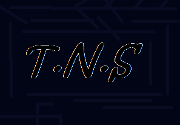
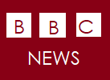

<html>
<head>
<body background="astronomy-gb9a3b3e76_1280.jpg">
	
	<h1 style="margin-left: 35%;">Get your news on time</h1>
	<h1 style="margin-left: 35%;">Get your kind of news</h1>
	<h1 style="margin-left: 35%;">Always your choice</h1>

		<h2 style="color: white">Get news of global and national together</h2>
		<h2 style="color: white">connect with various news network in one place</h2>
		<h2 style="color: white">connect with network such as BBC,SKY,CNN etc..</h2>
	<h1 style="color:white">__________________________________________________________</h1>
	<u><h1 style="color: white">GLOBAL NEWS SECTION</u></h1>
<h1 style="color: snow">choose your station</h1>
<h1 style="color: white">Get the news station that are floating in space for u. </h1>
<h3 style="color: yellow">click the channel you want to view</h3>
	<a href="https://www.bbc.com/news"><button onclick=""></button></a>
	 
        <a href="https://edition.cnn.com/"> <button style="margin-left: 8%"></button> </a>
	
        <a href="https://news.sky.com/"> <button style="margin-left: 10%"></button> </a>

         <a href="https://www.foxnews.com/"> <button style="margin-left: 13%"></button> </a>
	 
	 
         
          
         <a href="https://www.euronews.com/"> <button style="margin-left: 0%"></button> </a>
	
	<a href="https://www.theguardian.com/"> <button style="margin-left: 5%"></button> </a>

<u><h1 style="color: white">NATIONAL NEWS SECTION (Indian)</u></h1>

	
	<h1>choose your station</h1>
<a href="https://www.hindustantimes.com/"><button onclick=""></button></a>

<a href="https://timesofindia.indiatimes.com/"><button style="margin-left: 20"></button></a>

<a href="https://www.thestatesman.com/"><button style="margin-left: 20"></button></a>

<a href="https://indianexpress.com/"><button style="margin-left: 20"></button></a>

 
 
 
 
 

<a href="https://www.deccanherald.com/"><button style="margin-left: 20"></button></a>

	

Thank you for visiting this site

Designer contact for complaint:yashupadhayaya8@gmail.com 

view daily feed

	
